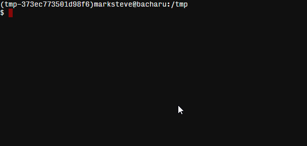

# pip-pin



## Install

```bash
pip install pip-pin
# But you should pipsi
pipsi install pip-pin
```

## Usage

```bash
pip_pin <source> [files...]
```

- `source` - Package list you want to get pinned versions from. You would want
this to be the output of `pip freeze`. Use `-` for `stdin`.

- `files` - Requirement files you want to update with pinned versions.

### From a file

```bash
pip freeze > pip.dump
pip_pin pip.dump requirements.txt
requirements.txt
  click               None -> 3.3
  Flask               None -> 0.10.1

Do you want to continue? [Y/n] y
```

### From stdin

```bash
pip freeze | pip_pin - requirements.txt
requirements.txt
  click               None -> 3.3
  Flask               None -> 0.10.1

```

### Multiple files

```bash
pip freeze | pip_pin - requirements-{prod,dev}.txt
```

## License

[MIT License](http://marksteve.mit-license.org)

